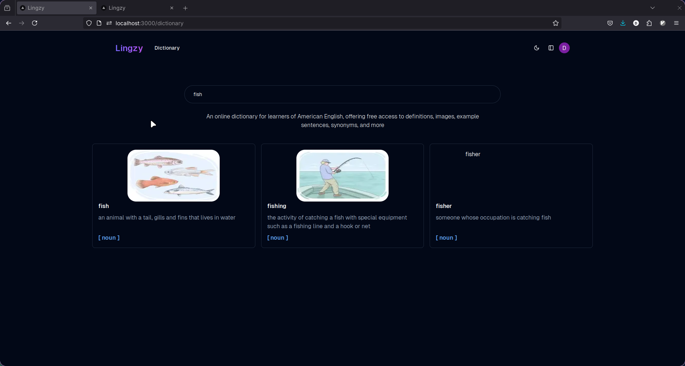
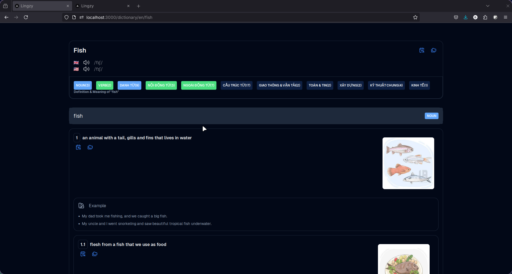
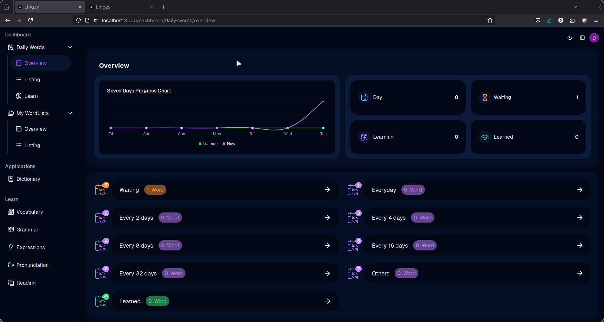
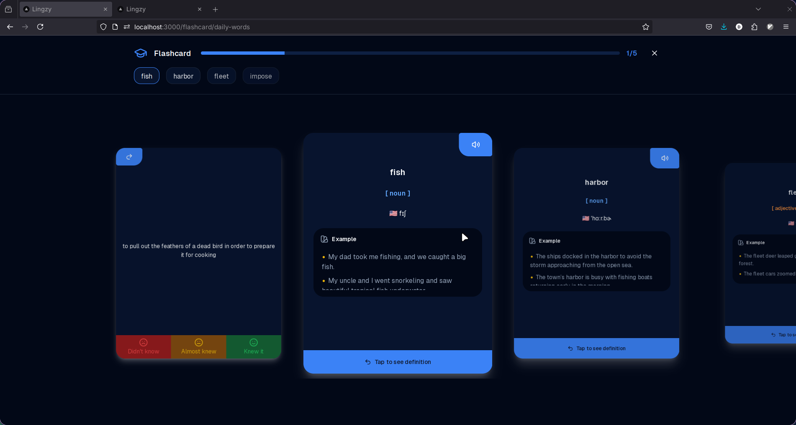

# Lingzy

Lingzy is a language learning platform that makes your learning process faster and easier. It provides tools for vocabulary acquisition, dictionary lookup, flashcards, and progress tracking.

## Screenshots

**Dictionary Search**

<p align="center">
  
</p>

**Word Details**

<p align="center">
  
</p>

**Profile Overview**

<p align="center">
  
</p>

**Flashcard**

<p align="center">
  
</p>

## Features

### 📚 Vocabulary Learning

- Daily word learning with spaced repetition
- Word lists for organizing vocabulary
- Progress tracking and statistics

### 📖 Dictionary

- Comprehensive dictionary for American English
- Definitions, examples, synonyms, and antonyms
- Audio pronunciations with phonetic transcriptions
- Word images for visual learning

### 🔄 Flashcards

- Interactive flashcards for vocabulary review
- Spaced repetition system for efficient learning
- Self-assessment with "Didn't know", "Almost knew", and "Knew it" options

### 📊 Progress Tracking

- Daily progress overview
- Statistics on waiting, learning, and learned words
- Seven-day progress chart

## Tech Stack

### Frontend

- [Next.js 15](https://nextjs.org/) - React framework with App Router
- [React 19](https://react.dev/) - UI library
- [TypeScript](https://www.typescriptlang.org/) - Type-safe JavaScript
- [Tailwind CSS](https://tailwindcss.com/) - Utility-first CSS framework
- [Radix UI](https://www.radix-ui.com/) - Unstyled, accessible UI components
- [Embla Carousel](https://www.embla-carousel.com/) - Carousel component
- [Recharts](https://recharts.org/) - Charting library
- [Lucide React](https://lucide.dev/) - Icon library

### Backend

- [Next.js API Routes](https://nextjs.org/docs/api-routes/introduction) - API endpoints
- [NextAuth.js](https://next-auth.js.org/) - Authentication
- [Drizzle ORM](https://orm.drizzle.team/) - Database ORM
- [PostgreSQL](https://www.postgresql.org/) - Database
- [Zod](https://zod.dev/) - Schema validation

## Installation & Setup

### Prerequisites

- [Node.js](https://nodejs.org/) (v20 or later)
- [pnpm](https://pnpm.io/) (v8 or later)
- [Docker](https://www.docker.com/) and [Docker Compose](https://docs.docker.com/compose/) (for PostgreSQL)

### Setup

1. Clone the repository:

   ```bash
   git clone https://github.com/yourusername/lingzy.git
   cd lingzy
   ```

2. Install dependencies:

   ```bash
   pnpm install
   ```

3. Create a `.env` file based on `.env.example`:

   ```bash
   cp .env.example .env
   ```

4. Update the `.env` file with your configuration.

5. Start the PostgreSQL database:

   ```bash
   docker-compose up -d
   ```

6. Run database migrations:

   ```bash
   pnpm migrate
   ```

7. Start the development server:

   ```bash
   pnpm dev
   ```

8. Open [http://localhost:3000](http://localhost:3000) in your browser.

## Database Schema

### Dictionary

- **words**: Base word entries with language and related words
- **pronunciations**: Phonetic transcriptions and audio files for words
- **translations**: Translations, examples, synonyms, and antonyms
- **sub_translations**: Additional translations for specific contexts
- **word_photos**: Images associated with words

### User

- **users**: User accounts and profiles
- **accounts**: OAuth accounts linked to users
- **daily_words**: Words assigned to users for daily learning with spaced repetition data
- **settings**: User preferences and settings
- **word_list_scores**: User progress on word lists

### Word Lists

- **word_lists**: Collections of words created by users

## Project Structure

```
lingzy/
├── public/              # Static assets
├── src/
│   ├── app/             # Next.js App Router
│   │   ├── (dashboard)/ # Dashboard routes
│   │   ├── (main)/      # Main routes
│   │   └── api/         # API routes
│   ├── components/      # React components
│   ├── config/          # Configuration files
│   ├── drizzle/         # Database migrations
│   ├── enums/           # TypeScript enums
│   ├── hooks/           # React hooks
│   ├── lib/             # Utility functions
│   │   └── server/      # Server-side code
│   └── types/           # TypeScript type definitions
├── .env.example         # Example environment variables
├── compose.yml          # Docker Compose configuration
├── drizzle.config.ts    # Drizzle ORM configuration
└── README.md            # Project documentation
```

## Usage

### Learning Vocabulary

1. Navigate to the "Learn" section
2. Choose "Vocabulary" from the feature cards
3. Browse available word lists or create your own
4. Add words to your daily learning queue
5. Review words with flashcards

### Using the Dictionary

1. Navigate to the "Dictionary" section
2. Search for a word
3. View definitions, examples, synonyms, and antonyms
4. Listen to pronunciations
5. Add words to your word lists

### Tracking Progress

1. Navigate to the "Dashboard" section
2. View your daily words overview
3. Check your seven-day progress
4. See statistics on waiting, learning, and learned words

## Contributing

Contributions are welcome! Please feel free to submit a Pull Request.

1. Fork the repository
2. Create your feature branch (`git checkout -b feature/amazing-feature`)
3. Commit your changes (`git commit -m 'Add some amazing feature'`)
4. Push to the branch (`git push origin feature/amazing-feature`)
5. Open a Pull Request

## License

This project is licensed under the MIT License - see the LICENSE file for details.
